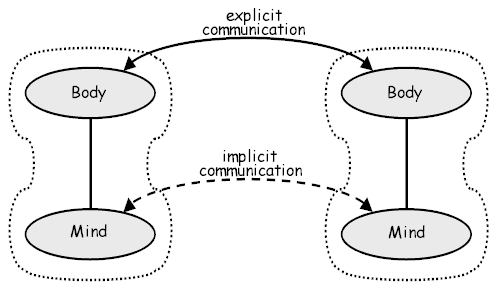

= 简介 / Introduction

:Author:    Li Monan
:Email:     limn@coreseek.com
:Date:      2020/06/20
:Revision:  0.1

== 缘起 / The Origin

因为工作需要，我需要快速培养一批 Rust 开发者。传统上常见的观点认为 Rust 语言的学习门槛比较高。但是，在学习、研究 Rust 语言的各种细节之后，我发现并不是 Rust 语言的学习门槛高，而是学习者对于计算机系统的基础知识掌握不扎实，导致在学习过程中，不得不囫囵吞枣、死记硬背各种概念。

也因为这个机缘，我了解了一些市面上常见的教编程语言的书（并不限于 Rust 语言）、培训材料，这些资料从语法开始讲起，进而进入较高阶的内容。但是，往往流于知识点的罗列，但是对于这个设计因何而起，是为了解决何种问题，有何缺陷等，大多语焉不详。而整个计算机领域，以单机硬件和网络为基础，构成了一个纺锤型的知识体系。

// TODO： 添加知识体系的图

include::figures/01_1_knowledge_hierarchy.adoc[]

[.text-center]
图 1-1  从工程的角度看计算机领域的相关知识点

这个纺锤形的知识体系决定了越往上层，因为需要对底层不同场景进行不同的抽象处理，因此需要了解的知识点越多。而如果从下往上看，无论上层使用何种语言，何种机制进行应用软件或系统软件开发，均存在对计算机设备稳定不变的抽象。了解了这些抽象与限制之后，上层系统的表现则无需死记硬背，就可以被理解。

但是，在现有的教学体系中，往往要求学习者在学会一门后，再去学另一门。但是，在整个漫长的学习过程中，对所学知识的应用与依赖关系往往描述过少。学习者需要很大的毅力去学习，且存在一种情况是其努力攻克的疑难点对齐日后的学习并没有帮助。

[.text-center]
include::figures/01_2_knowledge_seq.adoc[]

[.text-center]
图 1-2  烟囱型的知识体系构建

本教程将以 Rust 为引，尝试在计算机的各领域之间建立跨领域的联系，具体将包括四部分。

基础知识::
    
    - 内存管理与内存布局
    - 函数调用、编译和链接
    - 面向对象的思想与模拟
    - 错误处理
    - Rust 的常见语法规则

并发::
    
    - 硬件 对 并发的支持
    - 数据一致性的抽象
    - Async 和 .await 机制
    - Futures 机制

真实项目解析::

    - 系统调用与设备驱动原理
    - 常见网络编程模型
    - Mio
    - Bytes
    - Tokio 

高阶话题::

    - 单元测试
    - 行为驱动的测试
    - 系统模拟
    - Rust 宏
    - FFI
    - SIMD 

== 编程语言

在我们开始学习如何使用 Rust 进行程序设计之前，先让我们考察人与人之间的思考和交流机制，这种机制以及被人类用了几百万年。

两个人之间的互动在 下图 中表示为两条弧线。实线代表明确的交流：发出和感知的实际单词与动作。虚线弧表示隐式交流：形成显式交流的上下文的共享文化和经验。在人类交流中，许多实际的交流是通过引用共享上下文来实现的。

语言存在的目的在于为两个实体提供了交流的框架。更进一步的，可以认为是描述客观世界的某种抽象或虚拟。

为了与计算机“交流”（对计算过程进行抽象），人们发明了很多编程语言，Rust 是其中比较新的一种。

从不同的观点出发，对于计算过程的抽象也存在不同的方法：

- 从计算机硬件，有 ASM、C、Rust
- 从数学，有 Lisp、Schema、Haskell、OCaml
- 从自然世界到计算机的投射，有 Smalltalk、C++、Java、Erlang
- 从

- 语言对世界的描述 / 抽象